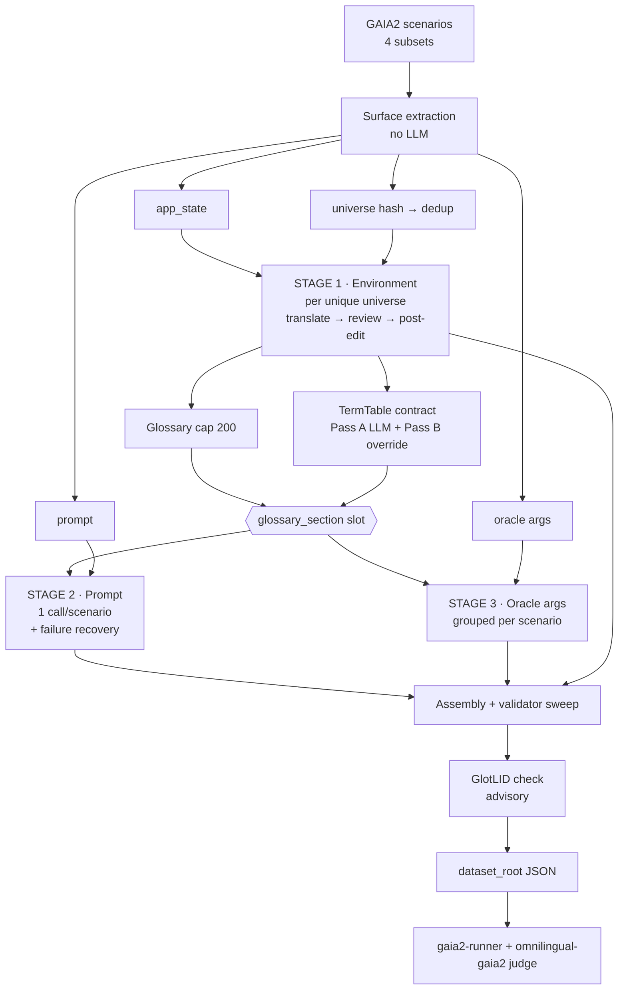

# Omnilingual-GAIA2 — pipeline design

Architecture reference for the machine-translation pipeline in `gaia2-cli/mt`.
Written to be usable both as onboarding material and as the source for a
methods section / appendix in a paper.

For install and run instructions see [`README.md`](README.md).
This document describes
*what the pipeline does and why*, and points at the code for each claim.

---

## 1. Scope

Omnilingual-GAIA2 is a **source-to-source benchmark translation pipeline**. It
consumes GAIA2 scenario JSON and emits a structurally identical `dataset_root`
in a target language, which the *unmodified* `gaia2-runner` then evaluates.

It is not a text-level MT system. It is a **structured-artifact localizer**: a
GAIA2 scenario is a tuple `(apps, events, metadata)` whose textual content is
spread across several surfaces, and the benchmark's oracle checkers perform
string and entity equality against those surfaces. Translating them
independently breaks the benchmark even when every individual translation is
good. Keeping them mutually consistent is the pipeline's core problem.

**Contract with the rest of the system.** The only interface between this
package and evaluation is the on-disk `dataset_root`:

```
<output_dir>/
├── search/        scenario_0000.json, scenario_0001.json, ...
├── execution/
├── ambiguity/
└── adaptability/
```

referenced verbatim as `[target].dataset_root` in a runner TOML. Everything
downstream — rollout, oracle checking, LLM-as-judge — is the runner's job.

---

## 2. The problem: cross-surface consistency

Naive surface-by-surface translation produces two failure classes, named in
[`gaia2_mt/translation/contract/__init__.py`](gaia2_mt/translation/contract/__init__.py):

| | Failure | Mechanism | Status |
|---|---|---|---|
| **F1** | Oracle-harness mismatch | A proper noun is translated in the prompt, but the oracle `eq_checker` still expects the English literal → the task becomes unsatisfiable. | Acknowledged, **out of scope** — needs a runner-side change. The pipeline only *labels* affected spans (`T_PINNED`) so leaks can be attributed. |
| **F2** | Translator-side incoherence | A quoted phrase in the user prompt is left in English while the `app_state` body the agent must search through *was* translated → the referent becomes unfindable and the task is silently impossible. | **Addressed** by the TermTable contract (§5). Reported effect: 86% reduction in F2 leaks across 25 scenarios in 3 languages on the prototype. |

Both are consistency failures, not quality failures. This is the pipeline's
central technical claim: **benchmark MT requires an explicit cross-surface
coordination mechanism, and per-string translation quality is not sufficient.**

A useful way to state it for a paper: ordinary MT is evaluated on adequacy and
fluency of each segment in isolation; benchmark MT additionally requires that
the *relational* structure between segments — which spans co-refer, which are
compared for equality by a checker — survives translation.

---

## 3. Translation surfaces

Four surfaces are extracted from each scenario. Each is translated by a
distinct stage, with a distinct prompt and batching strategy.

| Surface | Located by | Selection rule | Code |
|---|---|---|---|
| **User prompt** | `events[*]` whose `action.action_id` contains `send_message_to_agent`, arg `content` | Always; exactly one per scenario | [`data/parse.py::extract_initial_prompt`](gaia2_mt/data/parse.py) |
| **App state** | Recursive walk of `apps[i].app_state` | `APP_TRANSLATABLE_FIELDS`: per-app field allowlist over 12 apps. `SKIP_APPS = {AgentUserInterface, Files, City, Cabs}` | [`data/app_state.py`](gaia2_mt/data/app_state.py) |
| **Oracle args** | `events[*].action.args` | `TRANSLATABLE_ARG_NAMES` — 10 names: `content, body, subject, message, description, title, text, query, note, comment` | [`translation/translate.py::build_heuristic_translation_plan`](gaia2_mt/translation/translate.py) |
| **Oracle replies** | `send_message_to_user` events | Folded into the oracle-arg stage — **not** a separate pipeline | `SKIP_FUNCTIONS = {send_message_to_agent}` only |

Notes that matter for reproducibility:

- **Oracle-arg selection is a heuristic allowlist, not an LLM classifier.** An
  earlier version classified args with an LLM; it was replaced by the 10-name
  allowlist — zero cost, deterministic, auditable.
- **Oracle replies are deliberately localized.** Only the user prompt is
  excluded from the oracle-arg stage (it has its own reviewed pipeline);
  `send_message_to_user` expected responses flow through the oracle-arg stage
  alongside tool-call args, on the principle that *all* agent-visible and
  agent-produced text should be in the target language.
- **App-state coverage is an allowlist, not a full walk.** Only fields named in
  `APP_TRANSLATABLE_FIELDS` for that app are translated (e.g. `Calendar`:
  `title, description, tag`; `Emails`: `subject, content`). Structural and
  identifier fields are left untouched by construction.

### 3.1 The language registry

[`data/constants.py`](gaia2_mt/data/constants.py) defines 40 target codes in
NLLB-style `{iso639-3}_{Script}` form, in four typed groups. The type drives an
extra instruction block injected into every translation prompt
(`get_special_instructions`), and drives whether LID verification is
meaningful:

| Group | Count | Examples | Special handling |
|---|---|---|---|
| Standard (tiers 0–2) | 28 | `spa_Latn`, `hin_Deva`, `cmn_Hans`, `jpn_Jpan` | none |
| Romanized variants | 8 | `ben_Latn`, `urd_Latn`, `ara_Latn` | "write in Latin script, not the native script" block; **LID skipped** |
| English dialects | 3 | `eng_Latn_IN`, `eng_Latn_GB`, `eng_Latn_AU` | per-dialect adaptation block (spelling, vocabulary, units, date formats); **LID skipped** |
| Code-switched | 1 | `hin_Latn_CS` (Hinglish) | code-switching guidelines block; **LID skipped** |

`LID_SKIP_LANGUAGES` is exactly the union of the last three groups — GlotLID
cannot discriminate romanized text, English dialects, or code-switched output,
so verification is disabled rather than reported as spurious failure.

---

## 4. Components

```
gaia2_mt/
├── cli/translate.py            ENTRY POINT (Fire CLI) — two-pass orchestrator
├── translation/
│   ├── pipeline.py             load_dataset · process_split · build_final_dataset
│   │                           universe grouping · cross-split dedup
│   ├── translate.py            extraction + the 3 translation stages
│   └── review.py               review + post-edit for each of the 3 stages
├── translation/contract/       ── TermTable cross-stage contract ──
│   ├── term_extractor.py       Pass A: LLM cross-surface term identification
│   ├── term_table.py           span classes · builder · formatter · validator
│   ├── wiring.py               per-scenario assembly + (de)serialization
│   └── llm_adapter.py          Protocol → OpenAICompatInferencer bridge
├── data/
│   ├── parse.py                GAIA2 JSON accessors (prompt · response · events)
│   ├── app_state.py            universe hash · field walker · glossary · mutation
│   ├── constants.py            arg allowlist · 40-language registry · script,
│   │                           dialect and code-switch instruction blocks
│   └── models.py               OracleEventArg · ScenarioTranslation · SplitResult
├── llm/
│   ├── client.py               OpenAICompatInferencer — async batched OpenAI-compatible
│   ├── config.py               3-tier endpoint resolution
│   └── utils.py                JSON extraction robust to <think> traces
├── prompts/translation.py      7 templates: translate / review / post-edit × stages
├── lid.py                      GlotLID verification (informational)
├── checkpoint.py               resumable per-step JSON checkpointing
└── reporting.py                per-scenario audit DataFrame → CSV
```

Supporting material:

```
scripts/run_translate.sh        run wrapper (env-overridable, local vLLM)
scripts/data/{json_to_parquet,parquet_to_json}.py
                                per-scenario JSON ⇄ HF-style parquet shards
gaia2_mt/tests/                 import · endpoint resolution · glossary cap ·
                                reasoning-trace parsing · eval smoke
gaia2_mt/translation/contract/tests/
                                term table (24K) · term extractor · pipeline
                                wiring · upstream-contract smoke test
```

The contract subpackage is deliberately dependency-light: `term_table.py` and
`term_extractor.py` import nothing from `omnilingual-gaia2`, vLLM, or HuggingFace, so
the span-class logic and the Pass-A parser are unit-testable in isolation with a
stub LLM. That is why the bulk of the test weight sits there.

### 4.1 Data model

Four dataclasses carry state across stages
([`data/models.py`](gaia2_mt/data/models.py),
[`data/app_state.py`](gaia2_mt/data/app_state.py)):

| Type | Fields | Role |
|---|---|---|
| `AppStateField` | `scenario_idx, app_idx, app_name, field_path, field_value` | One translatable environment field. `field_path` is a tuple of dict keys / list indices, so `(app_idx, *field_path)` is a stable address into the scenario JSON. |
| `OracleEventArg` | `scenario_idx, event_idx, app, function, arg_name, arg_value` | One translatable oracle argument. `(scenario_idx, event_idx, arg_name)` is its key in the translation map. `app`/`function` are rendered into the prompt as translation context. |
| `ScenarioTranslation` | `scenario_idx, original_prompt, translated_prompt, prompt_review, failed, failure_reason` | Per-scenario audit trail, including the recovery outcome (§6.3). |
| `SplitResult` | translated `dataset`, prompts, responses, reviews, `oracle_arg_translations`, `app_state_translations`, `translation_plan`, `scenario_translations`, `lid_report` | Everything one split produced; consumed by the writer, the CSV reporter, and LID. |

Two key–value shapes recur and are worth fixing in notation:

```
universe_translations :  {universe_hash: {(app_idx, *field_path) → target}}
app_state_map         :  {(scenario_idx, app_idx, *field_path) → target}
oracle_arg_map        :  {(scenario_idx, event_idx, arg_name)   → target}
term_table.entries    :  {source_span → canonical_target_span}
```

Tuple keys are not JSON-serializable, so `checkpoint.py` provides
`serialize_tuple_key_dict` / `serialize_nested_tuple_key_dict` (and inverses)
that round-trip them as `[{"key": [...], "value": ...}]` lists.

### 4.2 LLM access layer

All model access goes through one class,
[`llm/client.py::OpenAICompatInferencer`](gaia2_mt/llm/client.py): a system-prompt
template plus a user-prompt template, formatted per input, dispatched
asynchronously.

| Property | Value | Note |
|---|---|---|
| Protocol | OpenAI-compatible `chat.completions` | Works against the internal an OpenAI-compatible server and against local vLLM unchanged |
| Concurrency | `asyncio.Semaphore(10)` | Results are re-indexed after `as_completed`, so **output order matches input order** — every stage relies on positional alignment |
| Temperature | `0.0` | Determinism, modulo server-side nondeterminism |
| Retries | `tenacity`, 5 attempts, exponential backoff 1–64 s | Retries on 5xx and rate limits; **not** on `BadRequestError` or other 4xx |
| Failure mode | returns `None` after exhausting retries | Every caller must handle `None`; this is what makes §6.3 recovery necessary |

Endpoint resolution ([`llm/config.py`](gaia2_mt/llm/config.py)) is three-tier,
which is what lets the same code run inside and outside the Meta network:

1. `GAIA2_MT_PER_MODEL_ENDPOINTS` — JSON `{model_name: base_url}`, for
   asymmetric setups (translator and reviewer on separate vLLM servers).
2. `GAIA2_MT_LLM_BASE_URL` — single-endpoint override; **all** models route
   here regardless of name. Pair with `GAIA2_MT_LLM_API_KEY` (vLLM accepts any
   non-empty value).
3. `DEFAULT_ENDPOINT` — `http://localhost:8000/v1`.

Resolution never depends on the model name: every model is served locally, and
there is no hosted fallback.

Two robustness details that exist only because of reasoning-tuned models:

- **`_extra_body_for_model`** injects
  `chat_template_kwargs.enable_thinking=False` for Qwen3-family names (both HF
  repo names and the shorter ids servers often advertise). Without it, the
  hybrid chat template
  emits `<think>…</think>` before the JSON payload, which either poisons the
  parser or overflows `max_model_len`.
- **`llm/utils.py::parse_json_response`** strips closed `<think>` blocks,
  handles an *unterminated* `<think>` (model ran out of budget mid-trace) by
  keeping everything after the last `</think>`, strips markdown fences, and
  falls back to scanning for the outermost `{…}`.

Both were added after a silent-failure incident: unparsed output → `None` →
source passthrough → an entire language's data written out still in English.
The lesson generalizes — in this pipeline, a parse failure degrades to
*untranslated*, not to *crashed*, so parser robustness is a data-integrity
concern, not a convenience.

---

## 5. The TermTable contract

The mechanism that addresses F2. Two properties make it cheap and auditable:

- **Derived, not generated.** Canonical target renderings come from the
  *already-executed* environment stage. The contract adds no consistency-inducing
  translation calls — only one lightweight extraction call per scenario.
- **Injected through an existing seam.** The table is rendered into the same
  `{glossary_section}` slot that the legacy glossary used, so stages 2 and 3
  needed no prompt-template changes.

### 5.1 Span classes

`TermTable` is a per-scenario map `source_span → canonical_target_span` plus a
parallel `provenance` map recording which class produced each entry. `add()` is
**first-write-wins on the source key**, so registration order *is* priority.

| # | Class | Source of the span | Canonical target | Default |
|---|---|---|---|---|
| ① | `T_PASSTHROUGH` | Filenames, identifiers, person names — see below | *identity* (`src → src`) | on |
| ② | `T_GLOSSARY` | Environment fields whose leaf ∈ `{title, subject, tag, name, job, property_type}` | Environment stage's output for that field | on |
| ③ | `T_EXTRACTED` | LLM Pass A: spans appearing on ≥2 surfaces | Environment output if the span is an exact field value; else the LLM's `recommended_translation` | on when `--term_table_extractor_model` is set |
| ④ | `T_QUOTED` | Quoted ASCII fragments in prompts that substring-match an environment field | Aligned substring of that field's translation | **off** |
| ⑤ | `T_PINNED` | Oracle arg values that also occur verbatim in a prompt | *(none — provenance re-label only)* | on |

**① `T_PASSTHROUGH`** — spans that must survive translation *unchanged*.
Detected by four patterns
([`term_table.py::detect_passthrough_spans`](gaia2_mt/translation/contract/term_table.py)):

1. Extension shape — `\.[A-Za-z0-9]{2,5}$` (`report.csv`, `notes.docx`)
2. Identifier shape — snake_case / kebab-case (`my_file`, `quarterly-report`)
3. Filename context in a prompt — `file|folder|document|attachment|sheet named|called|titled X` **and** `X` also occurs in `app_state` (the conjunct is a tightener: it prevents suppressing generic prose)
4. Person names — `Contacts` leaves in `{first,last,full,given,family}_name`, plus the `"First Last"` and `"First's"` composites, which are how prompts usually refer to them

The implementation detail is worth knowing when reading the code: `add()`
short-circuits when `source == target`, so passthrough entries are inserted
*directly* into `entries`/`provenance`, bypassing `add()`. The identity row then
**reserves the source key**, so any later class attempting to register a
translation for that span is silently skipped by first-write-wins — while
`apply_term_table` no-ops on `src == tgt`. The identity row is a *lock*, not a
substitution.

**⑤ `T_PINNED`** attaches no target. It only re-labels provenance so that leak
attribution can distinguish "this span is cross-stage" from "this span is a
glossary term". Spans with no canonical target are deferred: that is the F1
case, which needs a runner-side fix.

**④ `T_QUOTED` is a retained negative result.** The aligner projects the source
span's midpoint and length proportionally onto the target string, then snaps to
word boundaries within a search window. On real data it produced too many wrong
alignments — the recorded example is `'doctoral candidate'` →
`'bien. Como candidato'`. It is disabled by default and kept behind
`GAIA2_MT_TERM_TABLE_ENABLE_T_QUOTED` for ablation. The `T_EXTRACTED` path
(LLM Pass A) covers the substring-of-app-state case instead. Good material for
an ablation table: *learned* cross-surface identification beat *geometric*
alignment.

### 5.2 Pass A — LLM term extraction

One call per scenario
([`term_extractor.py`](gaia2_mt/translation/contract/term_extractor.py)). The
prompt presents three rendered surfaces:

| Slot | Content | Bound |
|---|---|---|
| `USER_PROMPT` | the initial user instruction | — |
| `ORACLE_REPLIES` | oracle args named `content`, `message`, `text`, `body` | — |
| `APP_STATE_SAMPLES` | `- [path] value` lines from the environment | 4 000 chars, then `…(+N more)` |

It returns strict JSON
`{"terms": [{"source", "surfaces", "recommended_translation"}]}`, where
`surfaces ⊆ {user_prompt, oracle_reply, app_state}`. The instructions ask for
every quoted phrase (even short ones), titles/subjects/names referenced
literally in the prompt, and entities appearing on any 2 of 3 surfaces; and
explicitly exclude generic vocabulary and cross-lingually invariant brand names.

`parse_extraction_response` returns `[]` on any parse failure, and the caller
logs and continues — so a Pass-A failure degrades the scenario to
glossary+passthrough coverage (documented at roughly 30% F2 coverage versus the
full path) rather than failing it.

### 5.3 Pass B — override from the environment stage

The step that actually closes the F2 loop. For each extracted term:

```
target ← universe_output[source]          if source is an exact app_state value
         else term.recommended_translation
```

The rationale for trusting the hint in the inexact case: the host field's
translation is too long to safely extract a fragment from without an aligner
(see ④), and the hint was produced by the *same model* that translated the host
field, so it is more likely than not to be consistent.

Worked example, from the module docstring:

1. Extractor flags `"schedule a call"` as cross-surface.
2. Environment stage renders the email body *containing* that phrase.
3. Pass B resolves `"programar una llamada"` and overwrites the hint.
4. Stages 2 and 3 receive it via `{glossary_section}`.
5. The validator sweep catches any residual leak in the assembled output.

### 5.4 The validator sweep

`apply_term_table(text, tt)` substitutes any table source span occurring
verbatim in `text` with its canonical target, and returns
`(rewritten, leak_count)`. Two correctness details:

- **Longest source first** — so `"schedule a call"` is substituted before
  `"a call"` could be. Defensive: substrings should not both be in the table,
  but the risk is capped anyway.
- **Word-boundary anchored** — `(?<![A-Za-z0-9_])…(?![A-Za-z0-9_])`, to avoid
  partial-word replacement.

The sweep is applied **only to the prompt and the oracle args, never to
`app_state`**. `app_state` is the *provider* of canonical targets; rewriting it
would be circular. This asymmetry is intentional and load-bearing.

`leak_count` is aggregated and logged per split
(`… N validator-sweep substitutions`), which makes it a directly reportable F2
metric.

### 5.5 Entry cap — a context-budget constraint

Both the legacy glossary and the TermTable are **inlined into every
per-scenario prompt**, so their size multiplies against every call. Both are
capped at **200 entries, ranked by shortest source string** — shortest-source
selects actual terminology (city names, single-word jobs, contact names) over
free-form description paragraphs that are not re-referenced across scenarios.

This default exists because of a concrete incident. The earlier uncapped
configuration produced a ~7 500-entry global glossary; a single prompt-translation
call emitted a 1 737-entry partial payload and the section overflowed a
131 072-token `max_model_len`, causing HTTP 400s that degraded to source
passthrough. The TermTable cap policy was fixed at the same time: an earlier
version exempted `T_PASSTHROUGH` from the cap on the theory that identity
entries never render — only partly true, since the extractor promoted thousands
of non-identity fields to `T_GLOSSARY`. The exemption dropped only ~2% of
entries. Current policy caps *all* classes together with priority
`{passthrough, extracted, pinned} > glossary > quoted`, then shortest source.

Overridable via `GAIA2_MT_TERM_TABLE_MAX_ENTRIES` and
`GAIA2_MT_GLOSSARY_MAX_ENTRIES`; `0` restores unlimited (legacy) behaviour.
Both validate their input and raise on a negative or non-integer value rather
than silently falling back.

---

## 6. The pipeline

Notation: `M_trans` = translation model, `M_rev` = review/post-edit model,
`M_extract` = Pass-A extractor model. `⊥` denotes a failed LLM call
(`None` after retries).

### 6.1 Orchestration — two passes

[`cli/translate.py::main`](gaia2_mt/cli/translate.py). The two-pass structure
exists so that environment translation can be deduplicated **globally**, across
subsets as well as splits — different subsets share many environments, so
per-subset dedup would leave most of the saving on the table.

```
TRANSLATE(dataset, src_lang, tgt_lang, M_trans, M_rev, M_extract):

  # ══ PASS 1 — load and globally deduplicate environments ═════════════
  U ← {}                                   # universe_hash → [AppStateField]
  for subset in {search, execution, ambiguity, adaptability}:
      D ← LOAD(dataset, subset)            # HuggingFace | local JSON directory
      for split in D:
          if exists(save_path/".{split}.done"):  skip      ▷ idempotent re-runs
          if limit: split ← split[:limit]                  ▷ smoke-test mode
      for scenario s in pending splits of subset:
          h ← xxh64(json(s.apps, sort_keys))               ▷ universe identity
          if h ∉ U:  U[h] ← WALK_TRANSLATABLE_FIELDS(s.apps)

  if U = ∅: return                         ▷ everything already done

  # ══ STAGE 1 (global) — translate each environment exactly once ══════
  T ← TRANSLATE_AND_REVIEW_UNIVERSES(U, …)               ▷ §6.2, checkpointed
  G ← EXTRACT_GLOSSARY(U, T)                             ▷ cap 200

  # ══ PASS 2 — per subset, per split ═════════════════════════════════
  for each (subset, split):
      R ← PROCESS_SPLIT(split, T, G, …)                  ▷ §6.3
      R.lid ← GLOTLID_VERIFY(R, tgt_lang)                ▷ advisory only
      for i in R.dataset:
          write save_path/f"scenario_{i:04d}.json"        (indent=2, UTF-8)
      write save_path/".{split}.done"
      assert file_count = row_count                       ▷ hard invariant
      log changed prompts / responses / args / app-state fields
      append audit rows → results_csv
```

Alternative entry points into stage 1, both used in practice:

- `--precomputed_universes <path>` — load a prior run's universe checkpoint and
  skip translation entirely. This is how a second language *variant* or a
  re-run with different stage-2/3 settings avoids redoing the dominant cost.
- `--skip_app_state` — skip stage 1 altogether (empty `T`, empty `G`). Fast
  smoke path for verifying a new language end-to-end.

### 6.2 Stage 1 — environment (universe) translation

```
TRANSLATE_AND_REVIEW_UNIVERSES(U):
  for h in U:
      B ← BATCH_BY_APP(U[h], size = {Emails: 5, EmailClientV2: 5,
                                     Shopping: 10, RentAFlat: 10,
                                     default: 20})
      inputs ← {"j": {context: "{app}.app_state.{path}", text: value}}
      T[h] ← M_trans(ORACLE_ARG_TRANSLATION_PROMPT, B)     ▷ JSON-keyed reply
      # unparseable batch  ⇒  keep source values for the whole batch
  save checkpoint "universe_translations"

  if not skip_validation:
      for h in U:
          B' ← BATCH_BY_APP(U[h], size = {Emails: 10, Shopping: 25,
                                          default: 50})     ▷ review is cheaper
          reviews ← M_rev(ORACLE_ARG_REVIEW_PROMPT, B')
          flagged ← {f : quality ≠ "good" ∧ issues ≠ ∅}
          T[h][f] ← M_rev(POST_EDIT_PROMPT, f)  ∀ f ∈ flagged   ▷ 1 call each
      save checkpoint "universe_reviews"
  return T
```

Design points:

- **Environment translation reuses the oracle-arg prompt**, with
  `user_prompt = ""` and `context = "{app}.app_state.{path}"`. One prompt
  template, two callers.
- **Per-app batch sizes** are a token-budget tradeoff: `Emails` bodies are long,
  so 5 per call; `Shopping`/`RentAFlat` entries are short, so 10–20. Review
  batches are 2–2.5× larger because a review verdict is shorter than a
  translation.
- **Batch-level failure granularity.** A batch whose JSON fails to parse keeps
  *source* values for every field in it, logged with the universe hash and app
  name. Failures are therefore visible and bounded, but coarse — one bad reply
  loses up to 20 fields.
- **Post-editing is per-field**, not per-batch, so a single flagged field does
  not force re-translation of its neighbours.

`extract_glossary` then derives `{source → target}` for short reference fields
only (`GLOSSARY_FIELDS`), deduplicating and dropping identity pairs. This is the
legacy consistency mechanism, still used as the batch-shared
`{glossary_section}` when the TermTable contract is off.

### 6.3 Stages 2–3 — per-split processing

[`translation/pipeline.py::process_split`](gaia2_mt/translation/pipeline.py).

```
PROCESS_SPLIT(S, T, G):

  # ── extraction — no LLM ─────────────────────────────────────────────
  P    ← [extract_initial_prompt(s) for s in S]
  E    ← [extract_expected_response(s) for s in S]      ▷ reporting only
  Plan ← [(i, event_idx, arg_name, value)
          for s_i ∈ S, ev ∈ events(s_i), (n, v) ∈ ev.args
          if ev.function ∉ SKIP_FUNCTIONS
             ∧ n ∈ TRANSLATABLE_ARG_NAMES ∧ is_nonempty_str(v)]

  # ── TermTable contract — needs T, so it runs before stages 2 and 3 ──
  contract ← (M_extract ≠ ⊥) ∧ (T ≠ ⊥)
  if contract:
      TT ← BUILD_SCENARIO_TERM_TABLES(S, T, M_extract)     ▷ §5, checkpointed
      sec[i] ← special(tgt_lang) + FORMAT_TERM_TABLE(TT[i])    ▷ per scenario
  else:
      sec[i] ← special(tgt_lang) + FORMAT_GLOSSARY(G)          ▷ shared
      TT[i] ← ⊥

  # ── STAGE 2 · prompts — 1 call per scenario ──────────────────────────
  P' ← M_trans(TRANSLATION_PROMPT, P, glossary_section = sec)
  F  ← {i : P'[i] = ⊥}                        ▷ content filter / error
  save checkpoint "translated_prompts"

  if not skip_validation:
      # review sees the UNTRANSLATED original prefixed with an explicit
      # [TRANSLATION FAILED] notice for i ∈ F
      P', reviews ← REVIEW_AND_POST_EDIT(P, P', M_rev, failure_flags = F)
      #  post-edit triggered when  (i ∈ F) ∨ (quality ≠ "good" ∧ issues ≠ ∅)
      #  i ∈ F is ALWAYS post-edited, even if the reviewer scored it "good"
      recovered ← {i ∈ F : P'[i] ≠ ⊥ ∧ P'[i] ≠ P[i]}
      F ← F \ recovered                       ▷ failure_reason records recovery
      save checkpoint "prompt_reviews"

  # ── STAGE 1' · fan out the precomputed environment translations ───────
  A ← {(i, app_idx, *path) → v
       | i ∉ F,  (app_idx, *path) → v ∈ T[xxh64(S[i].apps)]}
      # fallback when T was not precomputed: per-split universe dedup,
      # translate + review locally, then fan out (backward compatible)

  # ── STAGE 3 · oracle args — 1 call per scenario, args grouped ─────────
  Plan_ok ← {a ∈ Plan : a.scenario_idx ∉ F}
  O ← M_trans(ORACLE_ARG_TRANSLATION_PROMPT,
              group_by_scenario(Plan_ok),        # {"0": {context, text}, …}
              user_prompt      = P[i],           # SOURCE prompt as context
              glossary_section = sec[i])
      # missing key or unparseable reply ⇒ keep the source value, logged
  save checkpoint "oracle_args_translated"

  if not skip_validation:
      O ← REVIEW_AND_POST_EDIT_GROUPED(O, Plan_ok, P, M_rev)
      #  reviewer sees the user prompt + every arg with its tool-call context
      #  + all sibling args, so cross-arg inconsistency is detectable
      save checkpoint "oracle_args_reviewed"

  # ── ASSEMBLY · single-pass JSON mutation ─────────────────────────────
  for i ∈ S:
      if i ∈ F:
          emit S[i] UNCHANGED ; continue        ▷ English fallback, not dropped
      p ← APPLY_TERM_TABLE(P'[i], TT[i])                    ▷ leak substitution
      o ← {APPLY_TERM_TABLE(v, TT[i]) : v ∈ O[i]}
      emit MUTATE(S[i], prompt = p, oracle_args = o, app_state = A[i])
      # NB: no sweep over app_state — it is the source of canonical targets
```

Three behaviours to state explicitly in any writeup:

1. **Failed scenarios degrade to the English original, they are never dropped.**
   Scenario counts are therefore identical across all languages, which keeps
   cross-lingual comparison well-defined; and because the scenario is still
   present and still English, the failure is *observable* downstream rather than
   silently reducing `n`.
2. **Failure recovery is a first-class stage, not error handling.** A
   content-filter refusal is routed to the reviewer with an explicit
   `[TRANSLATION FAILED]` notice and *forced* into post-editing regardless of the
   review verdict (the reviewer may not have understood the notice). Successful
   recoveries are recorded as `prompt_translation_filtered_then_recovered`.
3. **Ordering constraint.** The TermTable must be built *before* stage 2, but it
   depends on stage 1's output — hence stage 1 is global and completes first.
   This is the reason for the two-pass orchestration, not merely an optimization.

### 6.4 Assembly and verification

`build_final_dataset` parses each scenario's JSON **once**, applies prompt,
oracle-arg and app-state mutations plus the validator sweep, and serializes
once. Mutations are addressed structurally, not textually:

| Mutation | Address |
|---|---|
| Prompt | `events[*]` with `send_message_to_agent` in `action_id` → arg `content` |
| Oracle arg | `events[event_idx].action.args[name == arg_name].value` |
| App state | walk `apps[app_idx].app_state` along `field_path`, assign the leaf |

Then, per split:

- **GlotLID verification** ([`lid.py`](gaia2_mt/lid.py)) — fastText
  `cis-lmu/glotlid`, CPU-only, confidence threshold 0.3, texts under 10 chars
  skipped. Reports per-surface `passed/checked/skipped/failed` plus up to 10
  example failures. **Advisory: it never blocks the pipeline.** Skipped entirely
  for `LID_SKIP_LANGUAGES` (§3.1). `cmn_Hans`/`cmn_Hant` both map to GlotLID's
  `cmn_Hani`, so script variant is not verifiable for Chinese.
- **Audit CSV** ([`reporting.py`](gaia2_mt/reporting.py)) — one row per
  scenario: truncated source/target prompt, review reasoning, quality,
  `preserves_meaning`, `is_fluent`, issues, suggestion, per-scenario counts of
  translated args and app-state fields, the `app.function.arg` list, and the
  per-prompt LID verdict. Review parse failures surface as
  `translation_quality = "PARSE_ERROR"` rather than being silently null.
- **Count invariant** — the writer asserts `#files == #rows` per split.

### 6.5 Resumability

Two independent mechanisms, both necessary at 640-scenario × 40-language scale:

| Granularity | Mechanism | Effect |
|---|---|---|
| Split | `.{split}.done` marker in the output directory | The split is skipped at load time; its universes are not even collected |
| Step | `CheckpointManager` JSON files | The step is loaded instead of re-run |

Checkpoint layout — global steps at subset root, per-split steps nested:

```
<checkpoint_dir>/
├── _global/
│   ├── universe_translations.json
│   └── universe_reviews.json
└── <subset>/
    └── <split>/
        ├── scenario_term_tables.json
        ├── translated_prompts.json
        ├── prompt_reviews.json          # prompts + reviews + failed_indices
        ├── oracle_args_translated.json
        └── oracle_args_reviewed.json
```

`prompt_reviews` deliberately stores `failed_indices` alongside the
translations, so resuming reconstructs the post-recovery failure set rather than
re-deriving it. Note that the oracle-arg path is asymmetric: resuming from
`oracle_args_translated` (without `oracle_args_reviewed`) re-runs review and
post-editing, which is the intended behaviour when a run was interrupted between
the two steps.

---

## 7. Diagram

```
                    ┌──────────────────────────────────────┐
                    │  GAIA2 scenarios (JSON)              │
                    │  4 subsets: search · execution ·     │
                    │  ambiguity · adaptability            │
                    └──────────────┬───────────────────────┘
                                   │
             ┌─────────────────────┴──────────────────────┐
             │  PASS 1 · surface extraction (no LLM)      │
             │  • prompt       ← send_message_to_agent    │
             │  • app_state    ← apps[].app_state walk    │
             │  • oracle args  ← arg-name allowlist       │
             │  • universe id  ← xxh64(apps)  ⇒ DEDUP     │
             └─────────────────────┬──────────────────────┘
                                   │
   ╔═══════════════════════════════▼════════════════════════════════════╗
   ║ STAGE 1 · ENVIRONMENT   (global, once per unique universe)          ║
   ║   batch per app ─▶ [M_trans] ─▶ [M_rev review] ─▶ [M_rev post-edit] ║
   ║   NB: both [M_rev] steps run only under --review (off by default)   ║
   ╚═══════════════════════════════╦════════════════════════════════════╝
                                   ║ universe_translations T
                    ┌──────────────╩──────────────┐
                    ▼                             ▼
        ┌───────────────────────┐    ┌──────────────────────────────┐
        │ GLOSSARY  (cap 200)   │    │  TERM-TABLE CONTRACT         │
        │ short reference fields│    │  Pass A [M_extract] 1/scen.  │
        │        (legacy path)  │    │  Pass B override from T      │
        └───────────┬───────────┘    │  ① passthrough ② glossary    │
                    │                │  ③ extracted ④ quoted(off)   │
                    │                │  ⑤ pinned  → cap 200         │
                    │                └───────────┬──────────────────┘
                    └──────────┬─────────────────┘
                               ▼  {glossary_section} slot
        ┌──────────────────────────────────────────────────────────┐
        │ STAGE 2 · PROMPT            │ STAGE 3 · ORACLE ARGS      │
        │ 1 call/scenario             │ 1 call/scenario, grouped   │
        │ [M_trans]                   │ [M_trans] + source prompt  │
        │      ↓                      │      ↓        as context   │
        │ [M_rev] review              │ [M_rev] review (sees all   │
        │      ↓  + FAILURE RECOVERY  │      ↓  sibling args)      │
        │ [M_rev] post-edit           │ [M_rev] post-edit          │
        └──────────────┬──────────────┴──────────────┬─────────────┘
                       └───────────┬──────────────────┘
                                   ▼
                 ┌──────────────────────────────────────┐
                 │ ASSEMBLY (single-pass JSON mutation) │
                 │  + VALIDATOR SWEEP: apply_term_table │
                 │    to prompt & oracle args only      │
                 │  failed scenarios ⇒ English original │
                 └──────────────────┬───────────────────┘
                                    ▼
                 ┌──────────────────────────────────────┐
                 │ GlotLID verification (advisory)      │
                 └──────────────────┬───────────────────┘
                                    ▼
                 ┌──────────────────────────────────────┐
                 │  dataset_root/<subset>/scenario_NNNN  │
                 │  .json  +  .<split>.done  +  CSV      │
                 └──────────────────┬───────────────────┘
                                    ▼
                 ┌──────────────────────────────────────┐
                 │  gaia2-runner  (UNMODIFIED)          │
                 │  + omnilingual-gaia2 judge prompts   │
                 │    (live in gaia2_core, not here)    │
                 └──────────────────────────────────────┘

  Cross-cutting: CheckpointManager (per-step JSON, resumable) ·
  .done markers (idempotent re-runs) · OpenAICompatInferencer
  (async, semaphore=10, T=0.0, tenacity ×5 exponential backoff)
```

Renderable version:



---

## 8. Design decisions

Each row is a decision that shaped the pipeline, with the reason it was made.

| Decision | Rationale |
|---|---|
| **Environment dedup by `xxh64(apps)`** | App state dominates translation volume, and GAIA2 scenarios share environments. Dedup is cross-subset *and* cross-split, computed globally before any per-split work. Turns the dominant cost term from `O(scenarios × fields)` into `O(universes × fields)`. |
| **The review pass is a retained negative result** | Off by default. A ten-language sweep with a cross-family reviewer, plus self-review and alternate-reviewer arms, was statistically indistinguishable from the reviewer-free baseline: it rewrote under 9% of fields, almost entirely stylistically, for roughly double the per-scenario latency. `translation/review.py` and the `--review` flag are kept so the result stays reproducible. Its one functional cost is that the post-editor was also the only recovery path for content-filtered prompts. |
| **Asymmetric two-model design** | When `--review` is enabled, `translation_model` translates and `review_model` reviews, defaulting to `google/gemma-4-31B-it` + `openai/gpt-oss-120b` to reduce self-preference. `GAIA2_MT_PER_MODEL_ENDPOINTS` lets the two run on separate vLLM servers. |
| **Heuristic arg selection over LLM classification** | A 10-name allowlist replaced an LLM classifier: zero cost, deterministic, auditable, and trivially inspectable when a surface turns out to be under-covered. |
| **Grouped-per-scenario oracle translation** | One call carries the user prompt plus every arg with its `app.function(arg=…)` context, so the model translates coherently and the reviewer can see cross-arg inconsistency. Cost is `O(scenarios)`, not `O(args)`. |
| **Oracle replies folded into the arg stage** | Expected `send_message_to_user` responses are ordinary translatable content; giving them a separate pipeline would duplicate logic and lose the sibling-arg context that makes the grouped review effective. |
| **Contract derived, not generated** | Canonical targets come from already-executed stage output. Consistency costs one lightweight extraction call per scenario, not a second translation pass. |
| **Contract injected via the existing prompt slot** | Reusing `{glossary_section}` means stages 2 and 3 needed no template changes, and the legacy glossary path remains available as a control condition for ablation. |
| **Failure recovery as a pipeline stage** | Content-filter refusals are common enough at scale to need a designed path: explicit failure notice to the reviewer, forced post-edit, recorded recovery outcome. |
| **Failed scenarios keep English text** | Preserves scenario counts across languages (comparability) and makes the failure observable downstream instead of silently shrinking `n`. |
| **Sweep excludes `app_state`** | `app_state` provides the canonical targets; sweeping it would be circular. |
| **Negative results retained behind flags** | `T_QUOTED` projection alignment is off by default after real-data validation but kept for ablation. Keeping the disabled path in-tree makes the ablation cheap to run and the claim checkable. |
| **LID is advisory, not blocking** | GlotLID is unreliable for 12 of the 40 target codes; blocking on it would reject valid romanized/dialect/code-switched output. Reported, never enforced. |
| **Entry caps on inlined terminology** | Both glossary and TermTable are inlined per call, so their size multiplies. The 200-entry cap is a hard context-budget requirement, not tuning (§5.5). |
| **Step-level checkpointing + `.done` markers** | At 640 scenarios × 40 languages, interrupted runs are the norm. Resume granularity is per pipeline step, and a completed split is skipped before its universes are even collected. |
| **`data/` and `contract/` free of heavy deps** | Span logic, parsers and extractors are unit-testable without vLLM or HuggingFace; this is where most test weight sits. |

---

## 9. Boundaries — and the judge-side overrides

**What this package does not do:**

- **Evaluation execution.** Entirely the `gaia2-runner`'s job. The contract is
  the on-disk `dataset_root`.
- **Judge execution.** The judge runs inside the runner container.
- **Universe / persona generation** is deliberately excluded — not needed for
  translate + evaluate.

**The judge prompt overrides are a subtlety worth stating precisely.** They are
not part of this package at all: they live in
[`gaia2_core/judge/omnilingual_gaia2_prompts.py`](../core/gaia2_core/judge/omnilingual_gaia2_prompts.py),
are wired up in
[`gaia2_core/judge/prompt_overrides.py`](../core/gaia2_core/judge/prompt_overrides.py),
and are selected via `[judge].prompt_version` in the runner TOML. They are
described here because they are a *methodological* companion to the translation
pipeline, not because this package executes them.

One version ships, `omnilingual-gaia2`. It starts from the *latest* upstream
gaia2-core checkers and applies the minimal edits needed to remove
English-centric bias; changes are tagged inline with `# OMNILINGUAL-GAIA2`.

The route there is itself a finding. Two earlier iterations, not shipped, tried
to specify correctness from scratch: first strict information completeness
(every semantic item in the reference must appear in the agent's message), then
core-information match plus an explicit catalogue of acceptable variations —
name forms, date formats, rephrasings, terse-reference/detailed-agent. Both
drifted from upstream as gaia2-core's own prompts moved, and both were
rewriting judgements that were not language-specific in the first place.
Diffing against upstream instead of replacing it is what made the override set
small enough to keep honest.

It covers six checkers — user-message, tone, email, message, event, signature —
with edits of these kinds:

- **Cross-lingual equivalence** stated explicitly: agent and reference may be in
  different languages; judge on semantic content only.
- **Greetings and sign-offs excluded** in any language and cultural convention
  (they are verified separately by the signature checker).
- **"plain English" → "plain text (in any language)"** in the tone checker.
- **Currency-symbol tolerance** — `$2,000` ≡ `€2,000` ≡ `2,000 EUR`, since the
  data source does not specify currency and a localized agent may reasonably
  pick a different symbol.
- **Language-agnostic title equivalence** for calendar events, with a worked list
  of acceptable variations.
- **Placeholder detection in any language** for signatures — `"Your assistant"`,
  `"Votre assistant"`, `"Asistente"`, `"Utilisateur"` and equivalents all fail.

The methodological point: **a translated benchmark needs a translated-benchmark
judge.** Reusing an English-tuned checker on localized output produces failures
that are artefacts of the judge's English assumptions, not of the agent. This is
a distinct contribution from the translation pipeline itself and should be
reported as such.

---

## 10. Configuration reference

### CLI — `python -m gaia2_mt.cli.translate`

The full flag list, with defaults, comes from the Fire CLI itself:

```
python -m gaia2_mt.cli.translate --help
```

Only the flags whose behaviour is not self-evident from the name are documented
here:

| Flag | Purpose |
|---|---|
| `--local_data_dir` | Load scenarios from disk instead of HuggingFace; tolerates a nested `dir/dir/subset/` layout. |
| `--src_lang` / `--tgt_lang` | Language codes from the registry (§3.1), *not* free-form names. |
| `--term_table` / `--noterm_table` | The TermTable contract (§5) is **on by default**; `--noterm_table` falls back to the legacy shared glossary. |
| `--term_table_extractor_model` | Model for the contract's extraction pass. Defaults to the translator, which is what the released dataset used. |
| `--review` | Adds the optional second review + post-edit pass. Off by default (§8). |
| `--skip_app_state` | Skips stage 1 entirely — a fast smoke path that intentionally produces an inconsistent dataset. |
| `--precomputed_universes` | Loads a prior universe checkpoint and skips stage 1, reducing a re-run to the per-scenario stages. |
| `--checkpoint_dir` | Enables step-level resumability (§6.5); without it an interrupted run restarts from zero. |
| `--results_csv` | Audit CSV path. Written whether or not `--review` ran; the review-derived columns are simply empty without it. |

### Environment variables

| Variable | Effect |
|---|---|
| `GAIA2_MT_LLM_BASE_URL` | Route **all** models to one OpenAI-compatible endpoint (vLLM). Highest-priority single override. |
| `GAIA2_MT_LLM_API_KEY` | API key; vLLM accepts any non-empty value. Required. |
| `GAIA2_MT_PER_MODEL_ENDPOINTS` | JSON `{model_name: base_url}` for asymmetric translator/reviewer deployments. Takes precedence over the above. |
| `GAIA2_MT_GLOSSARY_MAX_ENTRIES` | Glossary cap; default 200, `0` = unlimited |
| `GAIA2_MT_TERM_TABLE_MAX_ENTRIES` | TermTable cap; default 200, `0` = unlimited |
| `GAIA2_MT_TERM_TABLE_ENABLE_T_QUOTED` | Re-enable the deprecated projection aligner (ablation only) |

The `scripts/run_translate.sh` wrapper exposes `SUBSET`, `TGT_LANG`,
`DATASET_ID`, `TRANSLATION_MODEL`, `REVIEW_MODEL`, `LIMIT`, `LID_CHECK`,
`OUTPUT_BASE`, `OUTPUT_DIR`, `CHECKPOINT_DIR` and defaults the endpoint to
`http://localhost:8000/v1`. When `GAIA2_MT_LLM_BASE_URL` is set, model names
must match the server's `--served-model-name`.

---

## 11. Known quirks and caveats

Things a reader of the code — or of a paper drawing on it — should not be
misled by:

- **Batch-level failure granularity in stage 1.** One unparseable reply keeps
  source values for up to 20 fields. It is logged with universe hash and app
  name, but the loss is coarse; a per-field retry does not exist.
- **Model names must match `--served-model-name`.** The defaults
  (`google/gemma-4-31B-it`, `openai/gpt-oss-120b`) are the names the released
  run served; a different deployment needs them set explicitly.
- **Without `--review` there is no recovery path for content-filtered prompts.**
  The post-editor was the only mechanism that recovered them, so under the
  published translator-only configuration those scenarios ship with the prompt
  untranslated. They are counted and logged, not silently dropped.
- **Multiple splits write into one subset directory.** The writer emits
  `scenario_{idx:04d}.json` keyed on the *per-split* index into
  `save_path = output_dir/<subset>/`, so two non-trivial splits in the same
  subset would overwrite each other. GAIA2 ships a single split per subset, so
  this is latent rather than active — but it is an assumption, not a guarantee.
- **Expected responses have no dedicated pipeline.** They are handled through
  the oracle-arg stage, so `SplitResult` carries no response-review column and
  the audit CSV has no response-review section.
- **The `glossary` / `special` / `term_table` kwargs are threaded separately**
  through `process_split` rather than bundled into a single context object.
- **LID cannot verify Chinese script variant** — GlotLID maps both `cmn_Hans`
  and `cmn_Hant` to `cmn_Hani`.

---

## 12. Code map

Fastest route into the code for a given question:

| Question | Start at |
|---|---|
| What runs, in what order? | [`cli/translate.py::main`](gaia2_mt/cli/translate.py) |
| What happens to one split? | [`translation/pipeline.py::process_split`](gaia2_mt/translation/pipeline.py) |
| How is a surface found? | [`data/parse.py`](gaia2_mt/data/parse.py), [`data/app_state.py`](gaia2_mt/data/app_state.py) |
| What exactly is sent to the model? | [`prompts/translation.py`](gaia2_mt/prompts/translation.py) |
| How is consistency enforced? | [`translation/contract/term_table.py`](gaia2_mt/translation/contract/term_table.py) |
| Which spans are protected from translation? | `detect_passthrough_spans` in the same file |
| How are failures recovered? | [`translation/review.py::review_and_post_edit`](gaia2_mt/translation/review.py) |
| Why is my run producing English? | [`llm/utils.py::parse_json_response`](gaia2_mt/llm/utils.py) + the caps in §5.5 |
| Where do the numbers come from? | [`reporting.py`](gaia2_mt/reporting.py), [`lid.py`](gaia2_mt/lid.py) |
